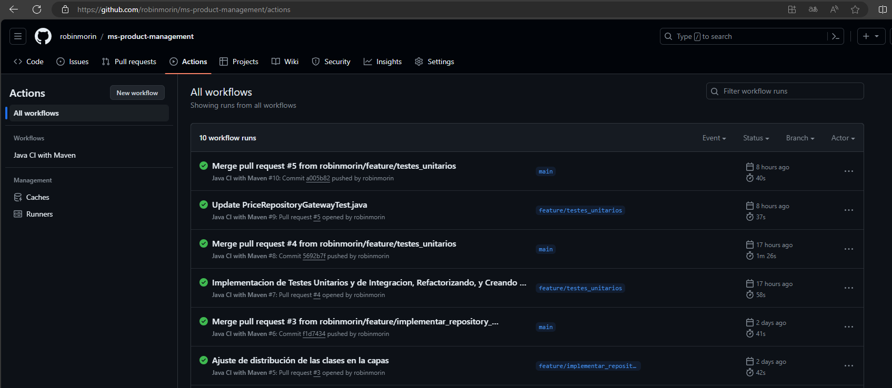

# API for Product Management

### *Stacks y librerias usadas en este microservicio*
- Spring Boot 3.2.3
- Java 17 (a partir de la versión 3 de Spring Boot, es requerido Java 17)
- Spring Data JPA 3.2.3
- H2 Database 2.2.224
- Lombok 1.18.30
- Spring Doc 2.3.0 (Swagger Specifications OAS 3.0)
- ArchUnit 1.2.1 (for JUnit5)
- JUnit Jupiter 5.10.2
- Mockito 5.7.0


### *Consideraciones en el desarrollo de este Microservicio*

1. **Arquitectura y Diseño**:
    - Opté por una estructura de proyecto basada en los principios de la **Arquitectura Hexagonal** y **Clean Architecture** *(esta ultima para descomplicar un poco el diseño de puertas y adaptadores)*, con esta estructura consegui desacoplar las capas de negocio, aplicación e infraestructura, facilitando la separación de las responsabilidades, y mejorando la escalabilidad y el mantenimiento de las funcionalidades.
    - Cabe destacar que no implementé interface para el interactor que define como la abstraccion (puerta) conecta al dominio con la capa de infraestructura, por lo que no tiene ningun sentido crear una interface en este caso, ya que el *interactor* *per-se* es una regla de negocio, y si se hace una interface de eso podria quedar redundante porque no existe la posibilidad que otro *interactor*  necesite implementar dicha interface, ya que, si se necesitara adicionar una nueva regla de negocio, se necesitara crear otro *Interactor* que la describa.
-----
2. **Principios de Clean Code**:
    - Me esforcé por aplicar los principios de **Clean Code**, dando atención a la creación de nombres significativos, clases pequeñas, responsabilidad única, manejo eficiente de errores, formateo legible del código y documentación precisa.
    - Aplicando estas prácticas conseguí mantener el código claro, legible y fácil de mantener.
-----
3. **Gestión de Fechas y Horas**:
    - Para manejar de manera más flexible y efectiva los objetos `LocalDateTime`, incorporé la dependencia `com.fasterxml.jackson.datatype:jackson-datatype-jsr310`, que se adhiere al estándar ISO8601 para la representación de fechas y horas.
-----
4. **Tests**:
   - Implementé los **tests unitarios** siguiendo la semántica AAA (Arrange/Act/Assert) que es equivalente a (Preparar/Ejecutar/Validar), lo que estandariza la organización de los tests facilitando su comprensión y mantenimiento.
   - Para los **tests de integración**, desarrollé una clase llamada `TestPlanUtils`
     La clase TestPlanUtils se encarga de leer un archivo JSON y cargar dos colas: una para los casos de prueba exitosos (successQueue) y otra para los fallidos (failsQueue).
     TestPlanUtils dispone de una Inner class StructPlan, este modelo posse toda la información necesaria para cada caso de prueba, 
     los campos de esa estructura son:
   
     -  `<testName>: Nombre del caso de prueba, para usar a discresión en la ejecución del test.`
     -  `<request>: Nodo con los datos para armar el request del test.`
     -  `<response>: Nodo con el JSON esperado para hacer el Assert con la respuesta de la petición.`
   
       El archivo JSON informado puede contener dos nodos principales: success y fails, sin embargo, puede contener solo uno de ellos segun sea la necesidad. Cada nodo contiene un array de objetos StructPlan.
       TestPlanUtils dispone de una Inner class Handler para facilitar la interacción con las colas, el Handler ofrece dos métodos:
       - `nextTest(): Retorna la información de cada caso de uso como una estructura StructPlan.`
       - `hasMoreTest(): Indica si hay más casos de prueba disponibles en la cola actual.`
     
       Desarrolle esta clase con el proposito de que se ejecute el mismo código para todos los casos de prueba de integracion, manteniendo el código limpio, poco verboso y reutilizable.

   - A continuación detallaré como fue utilizada esta clase utilitaria en la clase de TestExecutions:
    >- Se crea una instancia de la clase TestPlanUtils con la ruta del archivo JSON.
    >- Se obtiene un manejador (Handler) de la clase TestPlanUtils.
    >- Se ejecuta un bucle mientras haya más casos de prueba disponibles (hasMoreTest).
    >- En cada iteración del bucle, se obtiene el siguiente caso de prueba (nextTest).
    >- Se ejecuta el caso de prueba.

   ### Reporte de **cobertura** de los tests unitarios (Jacoco):
    

-----

5. **Persistencia y Datos**:
    - En el paquete `org.test.capitole.infrastructure.adapter.out.persistence.entity`, definí las entidades necesarias para mapear el dominio a la base de datos, demostrando mi capacidad para trabajar con Hibernate y definiciones de entidades y sus relaciones.
    - Cree el archivo `import.sql` conteniendo los DMLs que Hibernate ejecutara para poblar la base de datos con datos de prueba despues de haber creados las tablas partiendo de las definiciones hechas en las entidades.

   ### Console URL: http://localhost:8080/h2-console
   
   ### Tablas Creadas y populadas con datos de prueba
   

-----

6. **Configuración y Base de Datos**:
    - No incluí una clase específica para definir el datasource, ya que las configuraciones en `application.yml` permiten a Spring Boot configurar automáticamente la conexión con la base de datos H2, simplificando la configuración y el despliegue del microservicio.
-----

7. **Git y CI/CD**:
    - El codigo esta siendo entregado en un repositorio publico de Github
    - Las funcionalidades de este servicio han sido desarrollados en branchs feature cada una.
    - Configuré un Github Workflow (`archivo .github/workflows/maven.yml`) para ejecutar un mvn -B clean test package, para certificar que no existe codigo ni fucionalidad quebrada en la branch que se esta mezclando.
    - Cuando se hace merge de la feature para main, se ejecuta nuevamente el Workflow que compila y ejecuta los tests unitarios y de integración, certificando asi que se tiene un servicio libre de errores y que mantiene la funcionalidad de negocio garantizada.
    - Esta claro que flujo correcto de entregas a la branch main, deberia ser bajo el modelo de `GitFlow`, pero no fue requimiento explicito de este test.


   

-----

8. **Ejecución del microservicio e interfaz de usuario**:
   - Para la ejecución del microservicio puede usar el siguiente comando:
   
   ```bash
   mvn spring-boot:run
   ```
   Recuerde que esta configurado para subir en el puerto 8080.

	- Para acesso a la API tiene dos opciones:
		- Una vez que el servicio esta disponible en la puerta 8080, puede ejecutar el siguiente cURL con los parametros necesarios para busqueda:
		
	  ```bash
      curl --location 'http://localhost:8080/api/v1/products/35455/brand/1/price-to-apply?effectiveDate=2020-06-14%2010%3A00%3A00' --header 'accept: application/json'
      ```
		- Una vez que el servicio esta disponible en la puerta 8080, puede la interfaz Swagger en la siguiente Url:
		
	  ```bash
      http://localhost:8080/swagger-ui/index.html
      ```
   ### Swagger UI: http://localhost:8080/swagger-ui/index.html
   
   ### Click en [Try it out] para rellenar los datos para la busqueda
   


-----

9. **Otros adendos**:
    - El nombre del microservicio fue pensado en una visión de Dominio de Producto, ya que el precio en este caso seria una propiedad del producto, sin embargo, teniendo mas información del negocio completo tal vez podria dar un nombre mas adecuado, o podria adoptar algun standard basado en las convenciones definidas por la empresa.
    - La definición de la URL del endpoint, también fue pensada en los dominios de producto y brand que unidos a la fecha de aplicación conforman los parametros de busqueda en la base de datos. Dando un versionamiento /v1 al controller para abertura en el futuro a nuevas versiones de ese endpoint con mejorias.